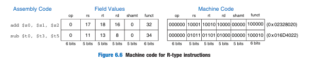

# 1. EMU 8086 Flag Registers

## 1.1 FLAG REGISTER
- A **special purpose** register 
- Depending upon the value of the result after any arithmetic and logical operation, the flag bits become `set (1)` or `reset (0)`. 
- In the 8086 microprocessor, the flag register consists of `8` bits and only `6` of them are useful.

## 1.2 Different Flag Registers

### `Zero Flag`
- After any arithmetical or logical operation, if the result is `0` (00)H, zero flag becomes `1`, otherwise `0`.

### `Carry Flag`
- Generated when performing n bit opertaions and the result is more than n bits.
- The result will be `1` if there is a carry, otherwise `0`

### `Auxiliary Flag`
- This flag is used in the **BCD(Binary Coded Decimal)** number system(0-9). 
- If after any arithmetic or logical operation D(3) generates any carry and passes it on to D(4) this flag becomes set i.e. `1`, otherwise, it becomes reset i.e. `0`.

### `Sign Flag`
- After any operation:
  - if the MSB (D(7)) of the result is `1`, it indicates the number is **negative** 
  - The sign flag becomes set, i.e. 1. If the MSB is `0`, it indicates the number is **positive** and the sign flag becomes reset i.e. 0.

### `Parity Flag`
- If, after any arithmetic or logical operation, the result has even parity, an **even number** of 1 bit, the parity register becomes set i.e. `1`, otherwise it becomes reset i.e. `0`.

### `Overflow Flag`
- In computer processors, the overflow flag (sometimes called the **V flag**) 
- is usually a single bit in a system status register used to indicate when an arithmetic overflow has occurred in an operation
- Note:
    | operand | operand | result | isOverflow
    |--|--|--|--|
    | 1 | 1 | 0 | true (1) 
    | 0 | 0 | 1 | true (1)
    | 1 | 1 | 1 | false (0)
    | 0 | 0 | 0 | false (0)
    | 1 | 0 | 1 | false (0)
    | 0 | 1 | 1 | false (0)
    | 1 | 0 | 0 | false (0)
    | 0 | 1 | 0 | false (0)

# 2. Machine Language

 - Assembly language is convenient for humans to read. However, *digital
 circuits understand only 1’s and 0’s.* 
 - Therefore, a program written in assembly language is translated from **mnemonics to a representation** using only `1`’s and `0`’s called **machine language**.

## MIPS Register Set

| Name | Number | Use |
|---|---|---|
| \$0 | 0 | the constant value 0 |
| \$at | 1 | assembler temporary |
| \$v0–$v1 | 2–3 | function return value |
| \$a0–$a3 | 4–7 | function arguments |
| \$t0–$t7 | 8–15 | temporary variables |
| \$s0–$s7 | 16–23 | saved variables |
| \$t8–$t9 | 24–25 | temporary variables |
| \$k0–$k1 | 26–27 | operating system (OS) temporaries |
| \$gp | 28 | global pointer |
| \$sp | 29 | stack pointer |
| \$fp | 30 | frame pointer |
| \$ra | 31 | function return address |

## 2.1 Three (3) Instruction formats
### 1. R-type Instruction
-  The name R-type is short for **register-type**. 
-  R-type instructions **use three registers as operands**: 
   -  Two (2) as sources:
      -  `rs` and `rt`
   -  One (1) as a destination:
      -  `rd`
-  The **32-bit instruction has six fields**: 
   -  `op`, `rs`, `rt`, `rd`, `shamt`, and `funct`. 

R - type
| op | rs | rt | rd | shamt | funct|
|--|--|--|--|--|--|
| 6 | 5 | 5 | 5 | 5 | 6 |

- **Instruction Fields:**
    * **`op`:** 
      * Opcode (6 bits)
    * **`rs`:** 
      * Source register 1 (5 bits)
    * **`rt`:** 
      * Source register 2 (5 bits)
    * **`rd`:** 
      * Destination register (5 bits)
    * **`shamt`:** 
      * Shift amount (5 bits)
    * **`funct`:** 
      * Function code (6 bits)
* **Operation Encoding:**
    * **`Opcode`:** 
      * Always 0 for R-type instructions.
    * **`Function Code`:** 
      * Determines the specific operation.
      * `32` for **adding**
      * `34` for **subtraction** 
* **Operand Encoding:**
    * **`rs, rt`:** 
      * Source registers.
      * The values are based on the MIPS register set 
    * **`rd`:** 
      * Destination register.
      * The values are based on the MIPS register set
* **Shift Operation**
  * **`shamt`:**
    *  indicates the amount toshift.
    * 0 for other R-type instructions.

**R - type**
|`fields` | op | rs | rt | rd | shamt | funct|
|--|--|--|--|--|--|--|
|`bits` | 6 | 5 | 5 | 5 | 5 | 6 |
|`values` | 0 | n | n | n | 0 | 32 (add) / 34 (subtract)|

Ex:

### 2. I-type Instruction